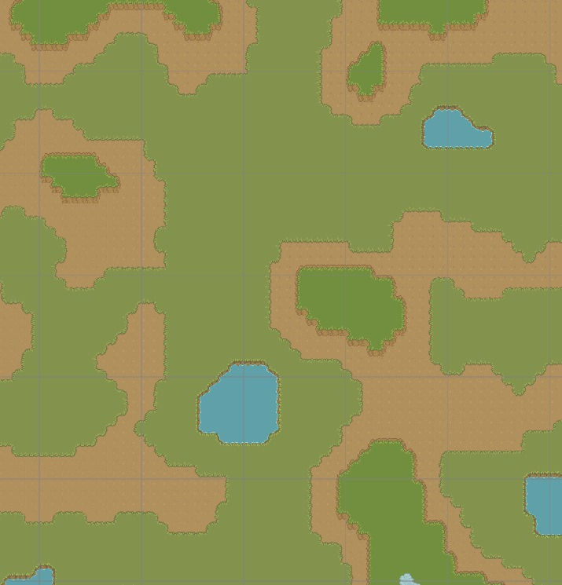
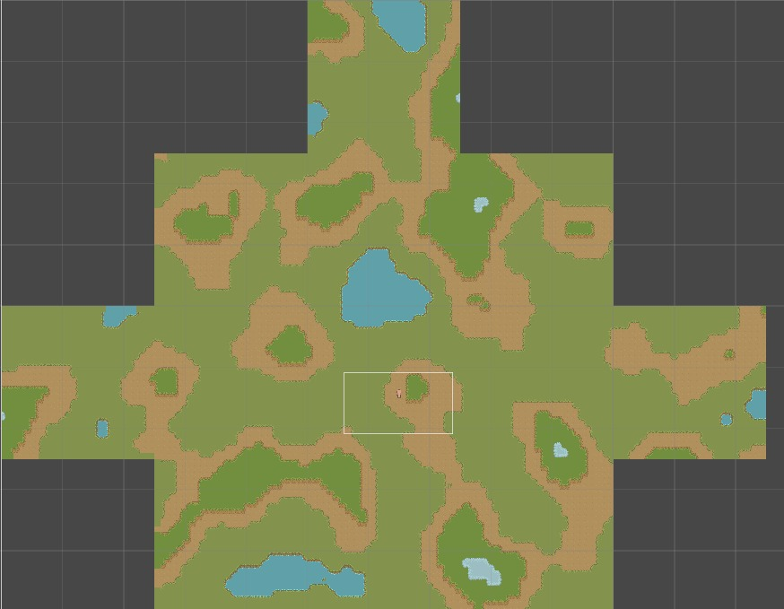

# Unity-Simple-Tilemap-Generator
基于 Unity 实现的 2D 瓦片地图程序化生成工具

## 资源声明 & 项目说明
1. 本项目中所使用的**美术资源（含瓦片、纹理、素材等）** 均来源于第三方资源站：[Cozy Farm](https://shubibubi.itch.io/cozy-farm)，版权归原作者所有，本项目使用付费授权瓦片资源，因版权限制未包含素材文件。
如需运行，请自行购买资源或替换为免费瓦片图。
2. 本项目为**个人学习用途**开发，仅用于研究 Unity 2D Tilemap 程序化生成、Job System 并行化等技术，非商业用途。
3. 项目仍处于开发阶段，**存在功能未完善、逻辑优化、Bug 修复等问题**，欢迎提 Issue 交流学习。

## 项目介绍
该项目在 Unity 引擎中实现了一个程序化生成的 2D 瓦片地图世界生成器。

整个游戏世界基于柏林噪声（Perlin noise）算法生成，并拆分为多个区块（chunk），以实现高效的资源流式加载（streaming）和内存管理。地形类型根据高度阈值划分，同时通过边界过渡规则，可自动在不同地形类型之间生成平滑的瓦片过渡效果。

为提升性能，噪声生成逻辑借助 Unity 的 Job System（任务系统）和 Burst 编译器实现了并行化处理。

## 示例效果：
  
  
### 参数配置
- **地图设置**
  - 区块数量：10 × 2
  - 单区块尺寸：25 × 25
  - 噪声缩放：15
  - 分形层数：6
  - 倍频程：3
  - 持续度：0.3
  -  lacunarity：2
  - 预生成半径：2
  - 卸载距离：4
