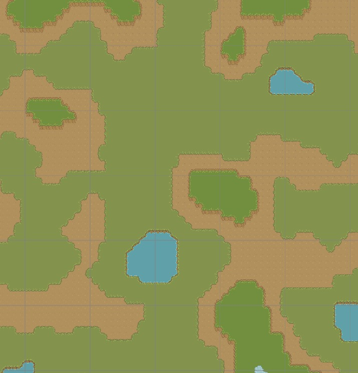
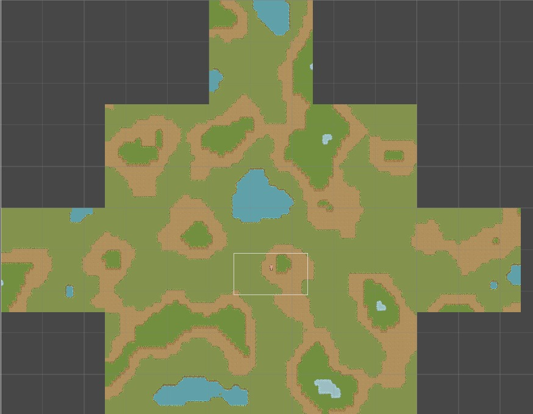

# Unity-Simple-Tilemap-Generator
基于 Unity 实现的 2D 瓦片地图程序化生成工具

## 资源声明 & 项目说明
1. 本项目中所使用的**美术资源（含瓦片、纹理、素材等）** 均来源于第三方资源站：[Cozy Farm](https://shubibubi.itch.io/cozy-farm)，版权归原作者所有，本项目使用付费授权瓦片资源，因版权限制未包含素材文件。

## 介绍
在 Unity 引擎中实现了一个简单的程序化生成的 2D 瓦片地图世界生成器，基于柏林噪声（Perlin noise），地形类型根据高度阈值划分，同时通过边界过渡规则，可自动在不同地形类型之间生成平滑的瓦片过渡效果，噪声生成逻辑借助 Unity 的 Job System（任务系统）和 Burst 编译器实现了并行化处理。

### 使用方法
#### 1. 基础地形瓦片

基础地形资产位于 `Assets/Resources/Data/MapData/Base Tiles/`
选中资产后，把 `Sprite` 换成自己的对应瓦片即可；需要碰撞的地形再调整 Collider Type。

#### 2. 过渡瓦片

过渡资产位于 `Assets/Resources/Data/MapData/Tile Transition Sets/`，
把图集中对应方向的过渡 Sprite 拖进对应槽位即可。
`要查看某条规则使用了哪个 Set，可打开 `Assets/Resources/Data/MapData/Boundary Rule/` 下的规则资产。

#### 3.配置新地形/过渡

项目右键菜单提供了三个入口：

- `2D Map > Terrain Tile`：新建基础地形资产，设置 Sprite 与 `type`
- `2D Map > Tile Transition Set`：新建过渡槽配置
- `2D Map > Boundary Rule`：新建规则，设置 `sourceType`、`adjacentType`、`transitionSet` 与 `priority`

如果只替换图片，推荐沿用现有资产，直接修改 Sprite；如果需要重新接线，在 `Assets/Resources/Prefabs/GridMap.prefab` 的 `DynamicTileMapGenerator` 组件中维护：

- `terrainTiles`：按低海拔到高海拔顺序排列
- `heightThresholds`：数量等于地形数减一
- `boundaryRules`：所有参与过渡的规则

若新增一种从未定义过的地形，除美术资源外，还需要在 `TileType` 枚举中增加对应类型。

## 示例效果：
 
